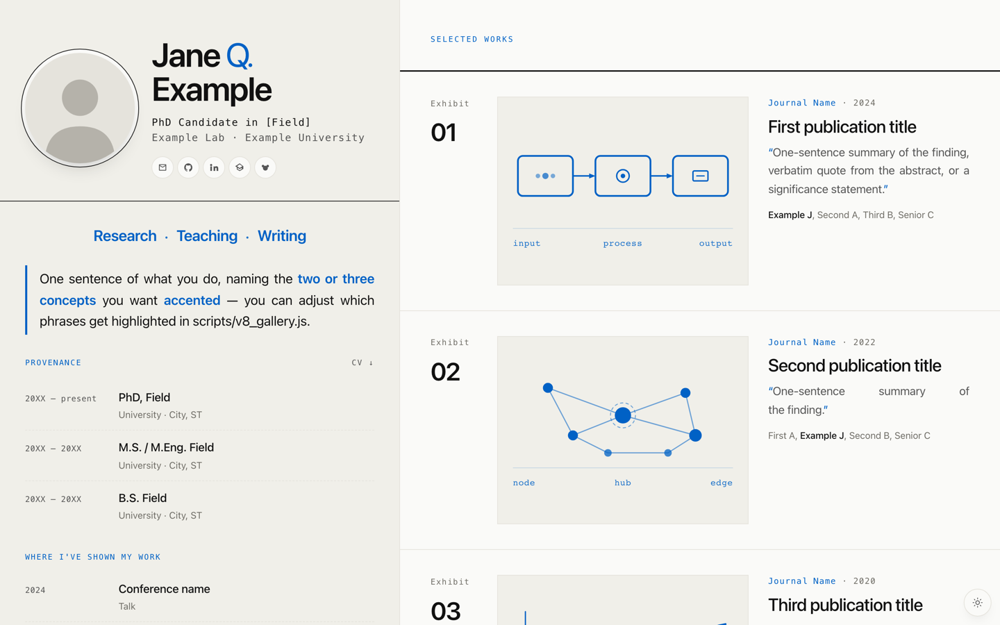
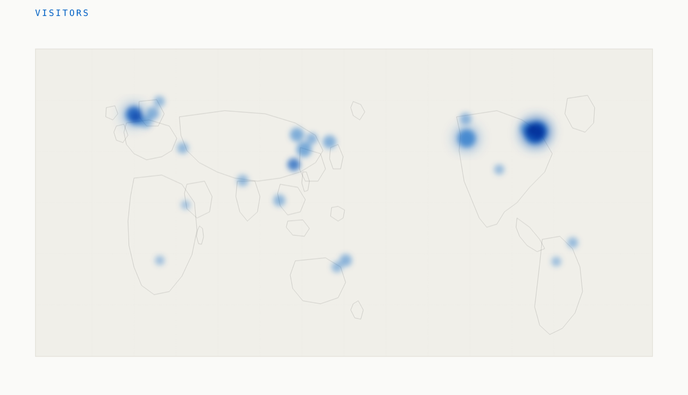

# Academic site — template

A zero-build static template for a personal academic website, wired for privacy-respecting visitor + CV-download tracking on Cloudflare Workers.



One live example deployed from this template: **[zhongqilin.org](https://zhongqilin.org)**.

## What you get

- **Static HTML / CSS / JS** — no framework, no build step, no npm install to run the site.
- **Cloudflare Worker** (`worker/index.js`) — serves the repo as static assets, plus two JSON endpoints:
  - `GET /api/visits` — per-city visit counts, used by the in-page world map
  - `GET /api/cv-stats` — total CV downloads and per-country breakdown
- **Workers KV** storage for the counters, with 24h IP-hash dedup and bot filtering.
- **Watercolor-style visitor map** — a Pacific-centered world map drawn as hand-plotted polygon outlines, with visitor cities rendered as soft blue blooms via SVG + CSS `mix-blend-mode`. No tile-server dependency, no external map library. See it in action below.
- **SF-family typography** via the system font stack — no webfonts downloaded, fast first paint.
- **Light/dark theme toggle** with View Transitions API and CSS fallback.
- **Mobile optimized** — dynamic viewport height, safe-area insets, dedicated breakpoint at ≤640 px.



## Quick start

```bash
# clone and serve the static layer
git clone https://github.com/<you>/<your-fork>.git
cd <your-fork>
python3 -m http.server 8000
# → http://localhost:8000
```

For the full Worker (API endpoints + local KV simulation):

```bash
npx wrangler dev
```

## Personalizing

Almost everything you'll edit lives in **`scripts/data.js`**:
- Name, role, email, social links
- `headshot: 'assets/headshot.jpg'` — drop your photo into `assets/`, update the path if the extension differs
- `cv: 'assets/your-cv.pdf'` — drop your CV at that path
- `bio`, `interests`, `pubs`, `education`, `experience`, `talks`, `skills`

Accented phrases in the bio are driven by `.replace()` calls in `scripts/v8_gallery.js` — match the strings to phrases in your `bio` text.

The visitor world map (`scripts/vmap.js`) is Pacific-centered by default — change `CENTER` at the top of the file to re-project around any other meridian.

## Deploying to Cloudflare

1. Push your fork to GitHub.
2. **Create a KV namespace** in the Cloudflare dashboard (`Storage & Databases → KV → Create`). Paste the namespace id into `wrangler.jsonc` under `kv_namespaces[0].id`, replacing `REPLACE_WITH_YOUR_KV_NAMESPACE_ID`.
3. **Connect your GitHub repo to Workers Builds** (`Workers & Pages → Create → Connect to Git`). It'll run `npx wrangler deploy` on every push to `main`.
4. **Set the `IP_SALT` secret** — used to hash visitor IPs so dedup is unguessable:
   ```bash
   openssl rand -hex 32 | npx wrangler secret put IP_SALT
   ```
5. (Optional) **Add a custom domain** in `Workers & Pages → <project> → Settings → Domains & Routes`. Cloudflare auto-inserts DNS if the domain's zone is on Cloudflare DNS.

## Privacy posture

The visit / CV tracking is designed to be data-minimal:
- **No raw IPs stored.** Dedup uses `SHA-256(ip + IP_SALT)` truncated to 64 bits, TTL'd to 24 h. After that window the hash is unrecoverable — there's no plaintext to correlate.
- **Only `{city, country, lat, lon, count}`** is persisted per city. No user agents, no cookies, no fingerprinting, no third-party calls.
- Edge geolocation (`request.cf`) is native to Cloudflare — visitor data never leaves their network.
- Bot / verified-bot / Cloudflare-internal warmup traffic is filtered pre-log — see `isProbablyBot()` in `worker/index.js`.

## File structure

```
.
├── index.html              # Entry point — loads scripts/*.js in order
├── assets/
│   ├── headshot.svg        # Placeholder silhouette — replace
│   └── your-cv.pdf         # Not committed — drop yours here
├── scripts/
│   ├── data.js             # ALL your content lives here
│   ├── teaser.js           # SVG teasers for each publication
│   ├── vmap.js             # World map + /api/visits client
│   └── v8_gallery.js       # Main renderer (CSS + DOM)
├── worker/
│   └── index.js            # Cloudflare Worker — static + /api/*
├── wrangler.jsonc          # Worker config (KV binding, assets dir)
├── .assetsignore           # Files excluded from the static-asset bundle
└── LICENSE                 # MIT
```

## License

[MIT](LICENSE) 
